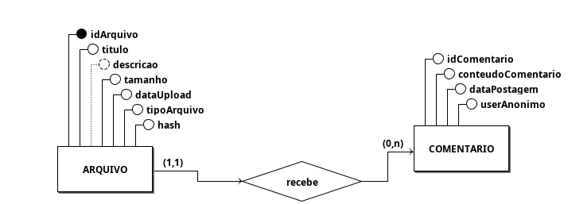
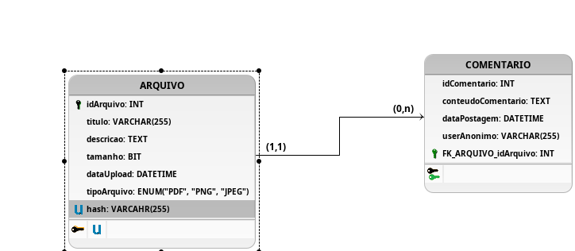
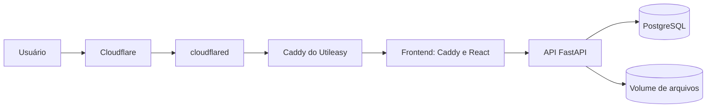

# UtileasyDoc

Aplicação para armazenar documentos e registrar comentários. Desenvolvida com React, Vite e TypeScript no frontend, FastAPI no backend e PostgreSQL, com execução via Docker Compose.

## Funcionalidades

- Envio de arquivos PDF, PNG e JPEG, com título preenchido inicialmente pelo nome original.
- Listagem, pesquisa e filtro por PDF ou imagem; exibição em lista ou grade.
- Detalhes, visualização e download de documentos; criação e histórico de comentários.
- Interface responsiva com tema claro e escuro.

## Requisitos adicionais

- **Idempotência por conteúdo:** o backend calcula o SHA-256 do arquivo e consulta a coluna `sha256`, que é única no PostgreSQL. Um novo envio dos mesmos bytes reutiliza o documento existente em vez de criar outro registro ou arquivo armazenado.
- **Limite de uploads por IP:** por padrão, são permitidas 5 tentativas em 10 minutos e 20 em 24 horas por IP. Os limites são configuráveis por variáveis de ambiente; quando excedidos, a API responde `429`. Arquivos têm limite padrão de 10 MB.
- **Publicação via Cloudflare Tunnel:** em produção, `docs.utileasy.com.br` usa o túnel e o Caddy do projeto Utileasy. O frontend deste projeto entra em uma rede Docker compartilhada sem publicar porta no host. O IP validado pelo proxy externo é repassado à API para o limite por IP. Veja [deploy.md](deploy.md).
- **Persistência e validação:** PostgreSQL e arquivos enviados usam volumes Docker; o backend valida formato, tamanho e conteúdo dos arquivos. As migrations são aplicadas na inicialização do backend.

## Execução local

É necessário ter Docker com Compose. Na raiz do repositório:

```bash
cp .env.example .env
# Edite .env: substitua change-me em POSTGRES_PASSWORD e DATABASE_URL pela mesma senha.
docker compose up -d --build
```

Aplicação: `http://localhost:8088` · documentação da API: `http://localhost:8088/api/docs`. Para acompanhar a inicialização, use `docker compose logs -f backend`. Para parar sem remover os dados, use `docker compose down` (não use `down -v`). O `.env` não deve ser versionado.

## Organização

```text
backend/app/modules/     Domínios de documentos e comentários, casos de uso e repositórios
backend/app/infrastructure/  PostgreSQL, armazenamento e limite de uploads
backend/app/presentation/    Rotas e validação das requisições
backend/migrations/     Histórico do esquema do banco
backend/tests/          Testes do backend
frontend/src/           Componentes, API, estilos e testes do frontend
docs/modelagemDados/   Diagramas conceitual e lógico originais
compose.yaml           Serviços locais e volumes persistentes
compose.home-tunnel.yaml  Configuração de produção com o túnel existente
```

## Modelagem de dados

Um documento pode receber vários comentários; cada comentário pertence a um documento.

**Modelo conceitual**



**Modelo lógico**



Os diagramas são a proposta inicial. A implementação acrescentou o hash único ao documento e uma tabela de tentativas de upload para o limite por IP. As [migrations](backend/migrations/versions) são a referência do esquema efetivamente usado.

## Arquitetura de produção



O UtileasyDoc usa o túnel e o proxy reverso já existentes no Utileasy; banco de dados e arquivos ficam em volumes próprios.
